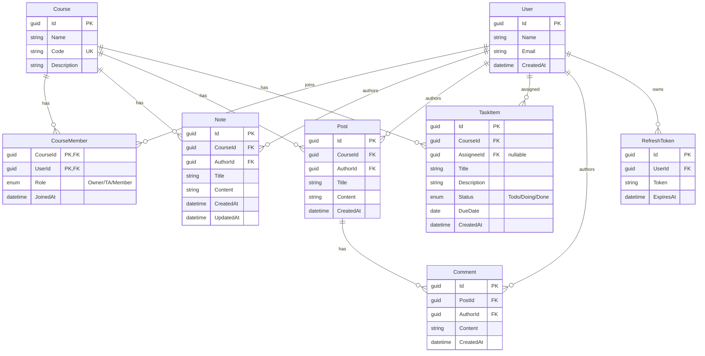

# CampusHub ER Model

實際 schema 由 EF Core Code First (EnsureCreated) 管理；CampusHub_CreateDatabase.sql 僅供參考。
EF 實際表：AspNetUsers, Courses, CourseMembers, Notes, Posts, Comments, Tasks, RefreshTokens（+ AspNet* Identity 表）。

關聯重點：
- CourseMember 多對多，複合 PK (CourseId, UserId)，Role 區分 Owner/TA/Member
- Note/Post/TaskItem 都屬於 Course（刪課程級聯刪除）
- TaskItem.AssigneeId 可為 null；Comment 只掛 Post
